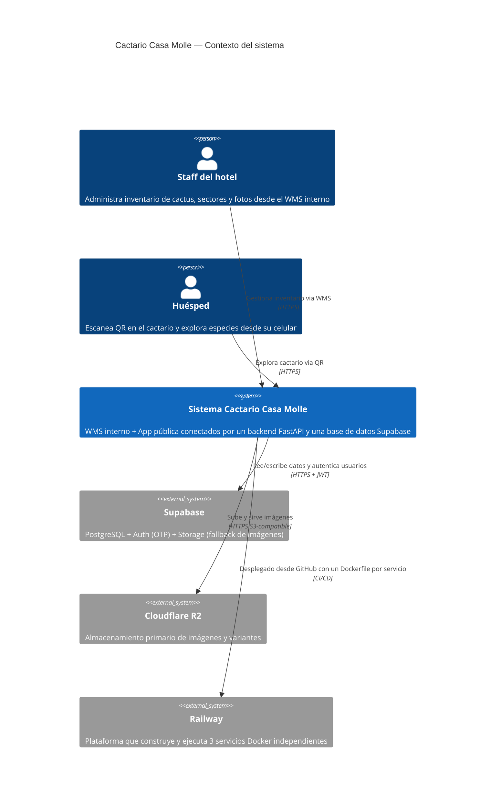
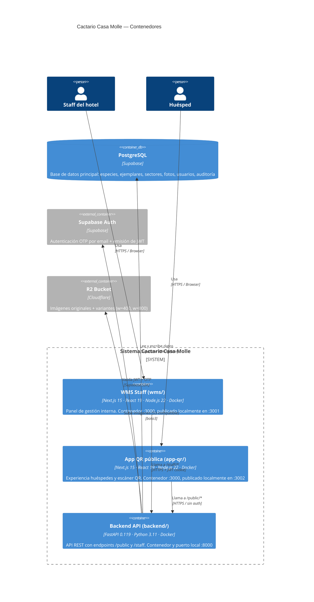
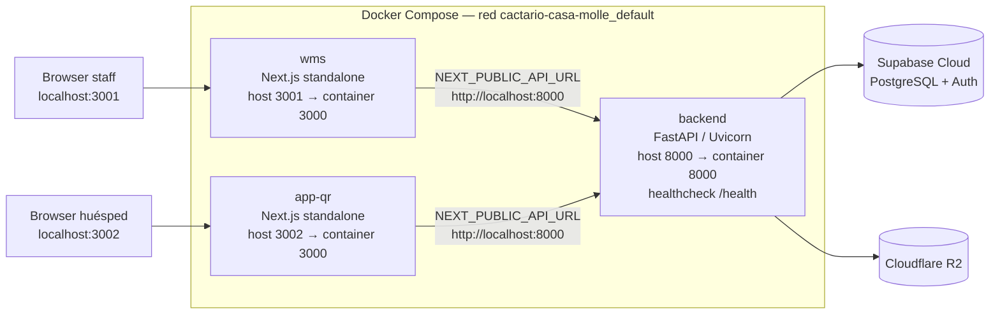
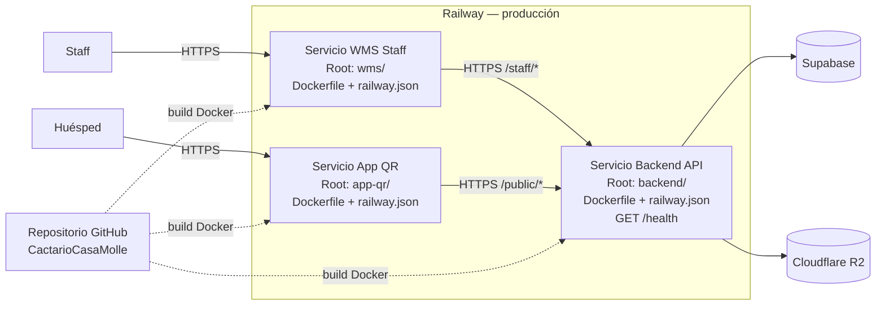
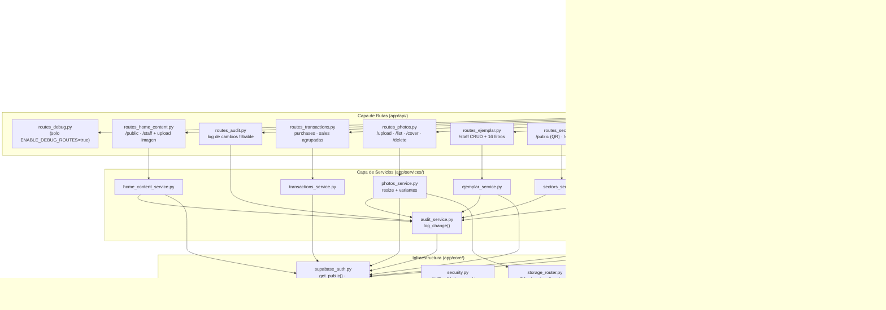
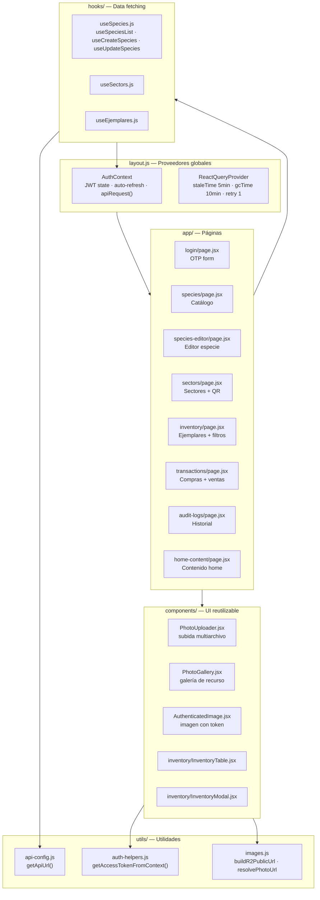
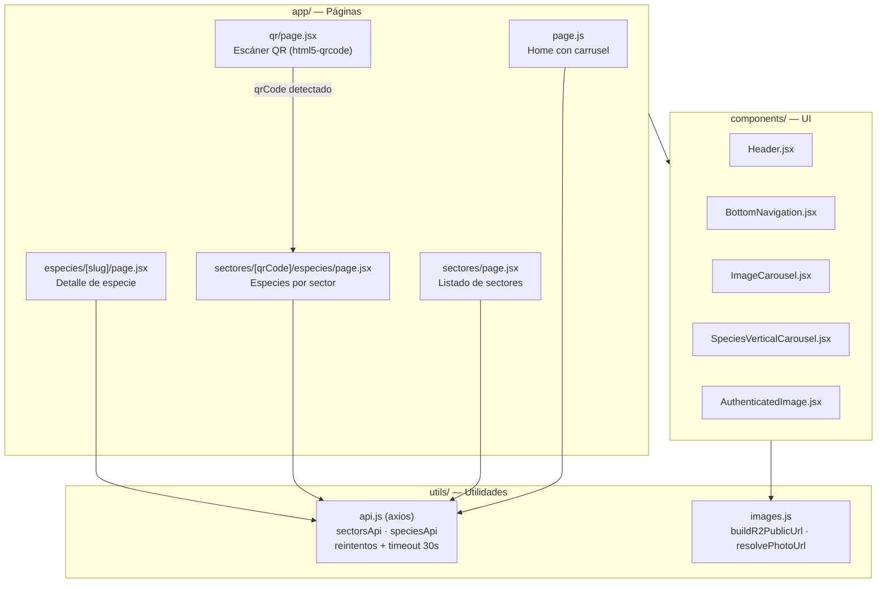
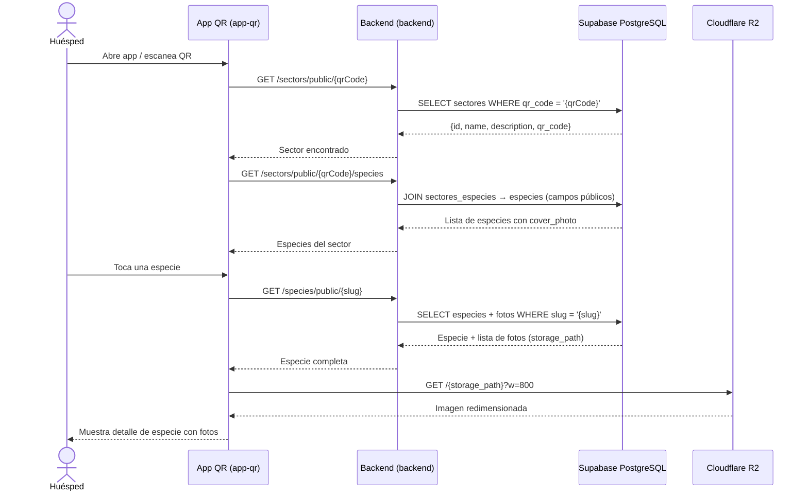
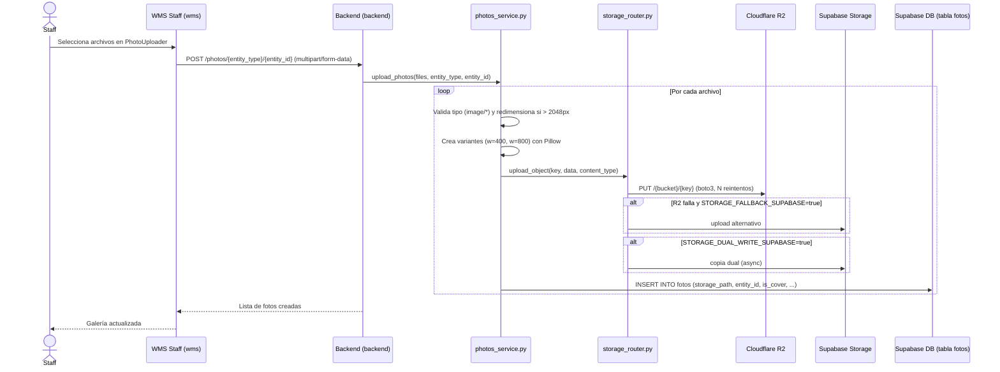

# Arquitectura del Sistema — Cactario Casa Molle

Sistema de gestión de cactáceas para un hotel boutique. Permite al staff administrar el inventario (especies, sectores, ejemplares, fotos, compras) y a los huéspedes explorar el cactario escaneando códigos QR.

---

## C4 Level 1 — Contexto del Sistema

Muestra quién interactúa con el sistema y qué sistemas externos utiliza.

---

## C4 Level 2 — Contenedores de aplicación

Muestra los tres servicios del sistema y cómo se comunican. Cada contenedor de aplicación corresponde a una imagen Docker desplegable de forma independiente.

---

## Vista de despliegue — Local con Docker Compose

`compose.yaml` orquesta el mismo conjunto de tres servicios para desarrollo o validación local. Supabase y R2 siguen siendo servicios cloud externos; no se crean contenedores de base de datos ni storage local.

| Servicio Compose | Contexto de build | Puerto contenedor | Puerto host | Configuración |
|------------------|-------------------|-------------------|-------------|---------------|
| `backend` | `./backend` | `8000` | `8000` | Secretos runtime desde `backend/.env` |
| `wms` | `./wms` | `3000` | `3001` | `NEXT_PUBLIC_*` incorporadas durante build |
| `app-qr` | `./app-qr` | `3000` | `3002` | `NEXT_PUBLIC_*` incorporadas durante build |

Los frontends esperan el health check exitoso de `backend` antes de iniciarse. Los archivos `.dockerignore` impiden copiar archivos `.env` locales a las imágenes.

---

## Vista de despliegue — Railway

En producción, Railway no ejecuta `compose.yaml` como una unidad. El repositorio se conecta a tres servicios Railway separados; cada servicio usa su directorio raíz, su `Dockerfile` y su `railway.json`.

| Servicio Railway | Directorio raíz | Runtime de imagen | Configuración relevante |
|------------------|-----------------|-------------------|------------------------|
| Backend API | `backend/` | Python 3.11 + Uvicorn | Variables secretas runtime; `IS_PRODUCTION=true`; health check `/health` |
| WMS Staff | `wms/` | Node.js 22 + Next.js standalone | `NEXT_PUBLIC_*` disponibles durante el build |
| App QR | `app-qr/` | Node.js 22 + Next.js standalone | `NEXT_PUBLIC_*` disponibles durante el build |

---

## C4 Level 3 — Componentes del Backend (`backend/`)

---

## C4 Level 3 — Componentes del WMS Staff (`wms/`)

---

## C4 Level 3 — Componentes de la App QR Pública (`app-qr/`)

---

## Flujo de datos — Escaneo QR de huésped

---

## Flujo de datos — Upload de foto (staff)

---

## Resumen de servicios en producción

| Servicio | Código fuente | Imagen de runtime | URL local con Compose | Infraestructura prod |
|----------|---------------|-------------------|-----------------------|---------------------|
| WMS Staff | `wms/` | Node.js 22 + Next.js standalone | `http://localhost:3001` | Servicio Railway independiente |
| App QR pública | `app-qr/` | Node.js 22 + Next.js standalone | `http://localhost:3002` | Servicio Railway independiente |
| Backend API | `backend/` | Python 3.11 + Uvicorn | `http://localhost:8000` | Servicio Railway independiente |
| Base de datos y Auth | Externo | Supabase Cloud | N/A | Supabase Cloud |
| Storage imágenes | Externo | Cloudflare R2 | N/A | R2 CDN / dominio custom |

### Clientes Supabase en el backend

| Función | Uso | RLS |
|---------|-----|-----|
| `get_public_clean()` | Endpoints `/public` | Respeta RLS anónimo |
| `get_public()` | Operaciones staff con token de usuario | Respeta RLS del usuario |
| `get_service()` | Auditoría y operaciones admin | Bypass completo de RLS |
