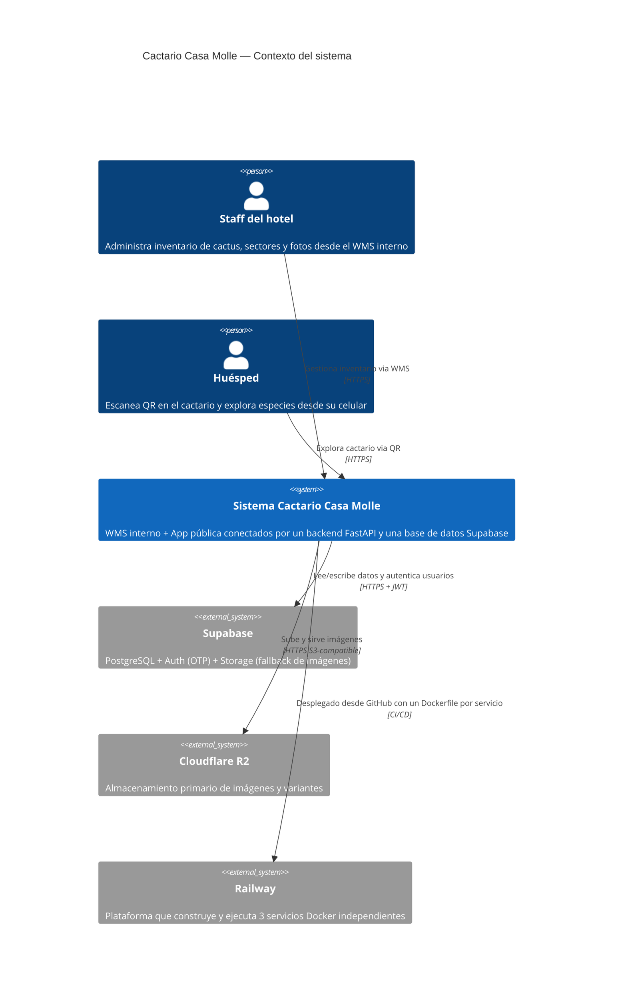
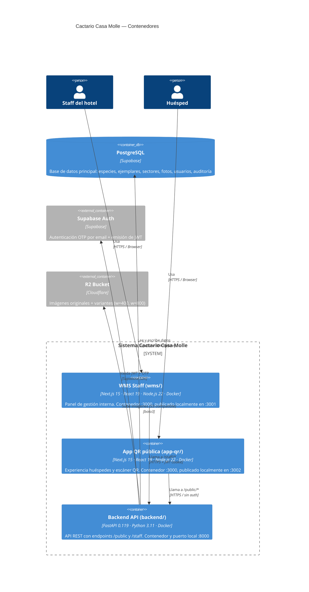
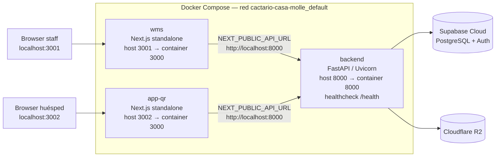
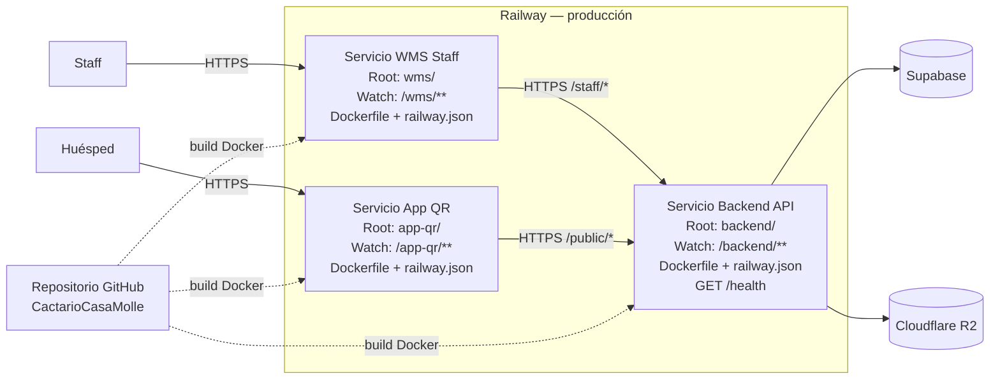
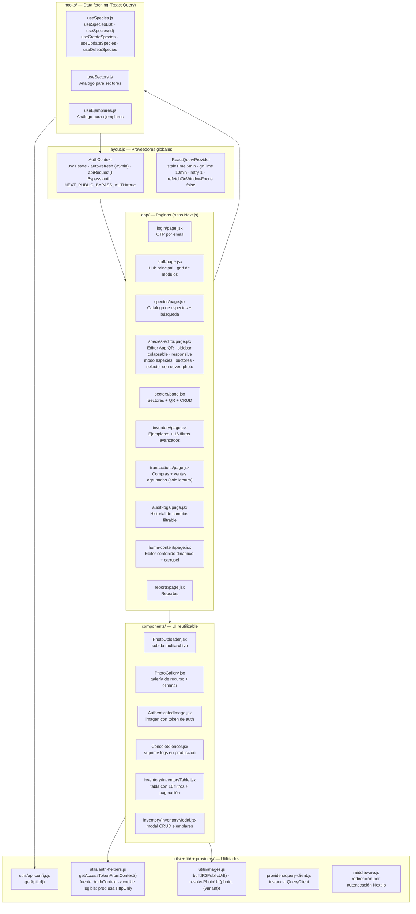
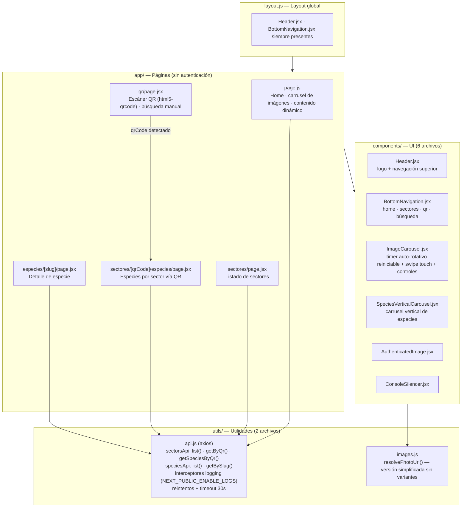
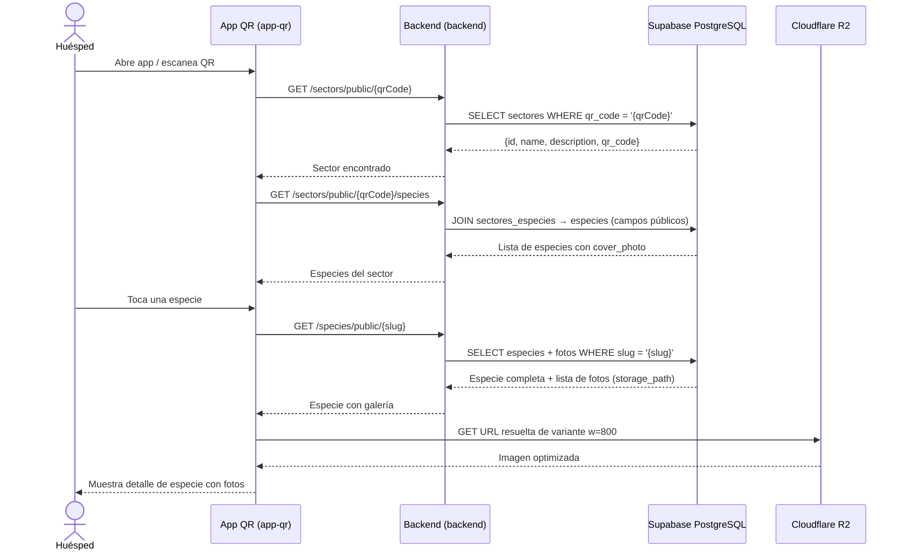
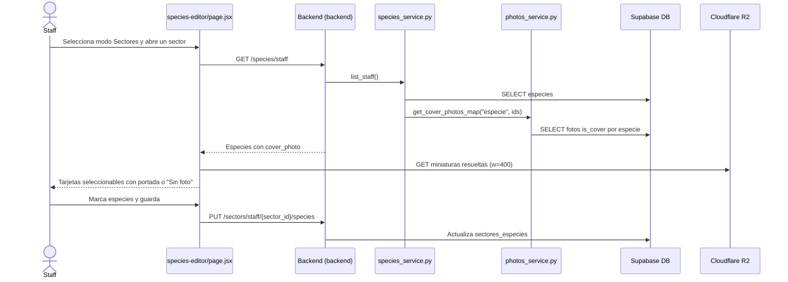
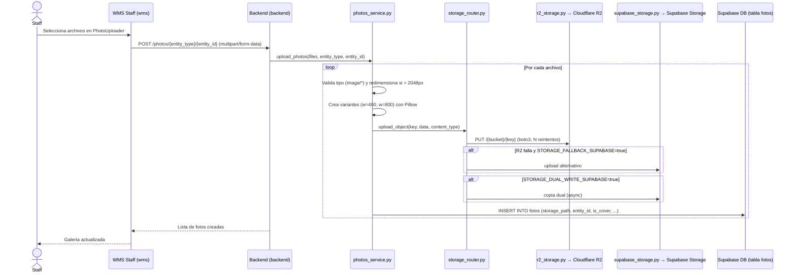

# Arquitectura del Sistema — Cactario Casa Molle

Sistema de gestión de cactáceas para un hotel boutique. Permite al staff administrar el inventario (especies, sectores, ejemplares, fotos, compras) y a los huéspedes explorar el cactario escaneando códigos QR.

---

## C4 Level 1 — Contexto del Sistema

Muestra quién interactúa con el sistema y qué sistemas externos utiliza.

---

## C4 Level 2 — Contenedores de aplicación

Muestra los tres servicios del sistema y cómo se comunican. Cada contenedor de aplicación corresponde a una imagen Docker desplegable de forma independiente.

---

## Vista de despliegue — Local con Docker Compose

`compose.yaml` orquesta el mismo conjunto de tres servicios para desarrollo o validación local. Supabase y R2 siguen siendo servicios cloud externos; no se crean contenedores de base de datos ni storage local.

| Servicio Compose | Contexto de build | Puerto contenedor | Puerto host | Configuración |
|------------------|-------------------|-------------------|-------------|---------------|
| `backend` | `./backend` | `8000` | `8000` | Imagen `python:3.11-slim`; secretos runtime desde `backend/.env`; `IS_PRODUCTION=false`; `ENABLE_DEBUG_ROUTES=false` |
| `wms` | `./wms` | `3000` | `3001` | `NEXT_PUBLIC_*` incorporadas durante build; `depends_on: backend (healthy)` |
| `app-qr` | `./app-qr` | `3000` | `3002` | `NEXT_PUBLIC_*` incorporadas durante build; `depends_on: backend (healthy)` |

El backend local en Docker es una instancia propia de FastAPI. No llama al backend de Railway ni reutiliza su runtime. Se conecta directamente a Supabase y R2 con las variables de `backend/.env`. Si ese `.env` apunta al mismo proyecto Supabase de producción, los datos creados o modificados localmente quedan disponibles para Railway porque ambos backends leen la misma base.

Los frontends esperan el health check exitoso de `backend` antes de iniciarse. Los archivos `.dockerignore` impiden copiar archivos `.env` locales a las imágenes.

Los contenedores `wms` y `app-qr` ejecutan el build standalone de Next.js. No montan `src/` ni ofrecen hot reload: un cambio de JSX requiere reconstruir el servicio correspondiente con `docker compose up -d --build wms` o `docker compose up -d --build app-qr`. Para desarrollo interactivo se usan los comandos `npm run dev:wms` y `npm run dev:app-qr`.

---

## Vista de despliegue — Railway

En producción, Railway no ejecuta `compose.yaml` como una unidad. El repositorio se conecta a tres servicios Railway separados; cada servicio usa su directorio raíz, su `Dockerfile` y su `railway.json`.

| Servicio Railway | Directorio raíz | Archivo de config | Watch path | Configuración relevante |
|------------------|-----------------|-------------------|------------|------------------------|
| Backend API | `backend/` | `/backend/railway.json` | `/backend/**` | Dockerfile `python:3.11-slim` + Uvicorn; `runtime.txt` declara `python-3.11.9`; secretos runtime; `IS_PRODUCTION=true`; health check `/health` |
| WMS Staff | `wms/` | `/wms/railway.json` | `/wms/**` | Node.js 22 + Next.js standalone; `NEXT_PUBLIC_*` durante build |
| App QR | `app-qr/` | `/app-qr/railway.json` | `/app-qr/**` | Node.js 22 + Next.js standalone; `NEXT_PUBLIC_*` durante build |

El repositorio migró los directorios de servicios de `nextjs/`, `mobile/` y `fastapi/` a `wms/`, `app-qr/` y `backend/`. Railway filtra los pushes mediante los watch paths configurados en cada servicio; si un servicio conserva una ruta anterior, reporta `No deployment needed - watched paths not modified` y no llega a leer el `railway.json` nuevo. En una migración se debe actualizar una vez el watch path en el Dashboard y ejecutar **Deploy Latest Commit**.

---

## C4 Level 3 — Componentes del Backend (`backend/`)

```mermaid
flowchart TD
  request(["Request HTTP"])

  subgraph middleware["Middleware (app/middleware/)"]
    auth_mw["auth_middleware.py\nExtrae JWT → Authorization header o cookie → request.state.user"]
    rate["rate_limiter.py\nLimitación de tasa en auth endpoints"]
    cors["CORSMiddleware en main.py\nlocales + Railway + ngrok"]
  end

  subgraph api["Capa de Rutas (app/api/) — 9 routers"]
    r_auth["routes_auth.py\n/auth · OTP · refresh · logout · /me"]
    r_species["routes_species.py\n/species · /public + /staff CRUD"]
    r_sectors["routes_sectors.py\n/sectors · /public (QR 3 estrategias) · /staff CRUD + N:M"]
    r_ejemplar["routes_ejemplar.py\n/ejemplar · /staff CRUD + 16 filtros"]
    r_photos["routes_photos.py\n/photos · upload · list · cover · delete"]
    r_tx["routes_transactions.py\n/transactions · compras + ventas agrupadas (solo lectura)"]
    r_audit["routes_audit.py\n/audit · log filtrable"]
    r_home["routes_home_content.py\n/home-content · /public + /staff · multi-idioma es|en · upload imagen"]
    r_debug["routes_debug.py\n/debug · solo ENABLE_DEBUG_ROUTES=true"]
  end

  subgraph services["Capa de Servicios (app/services/) — 7 archivos"]
    s_species["species_service.py\nCRUD · PUBLIC_SPECIES_FIELDS · slug único · cover photos"]
    s_sectors["sectors_service.py\nCRUD · búsqueda QR 3 estrategias · relación N:M sectores_especies"]
    s_ejemplar["ejemplar_service.py\nCRUD · 16 filtros · crea sectores_especies al crear ejemplar"]
    s_photos["photos_service.py\nresize max 2048px · variantes w=400/w=800 · metadata tabla fotos"]
    s_tx["transactions_service.py\nagrupa por purchase_date + nursery + invoice_number"]
    s_audit["audit_service.py\nlog_change() · get_audit_log() · siempre get_service()"]
    s_home["home_content_service.py\ncontenido dinámico · soporte es|en"]
  end

  subgraph models["Modelos ORM (app/models/) — 2 archivos"]
    m_species["species.py\nModelo Especie (28+ campos)"]
    m_sectors["sectors.py\nModelo Sector (id, name, description, qr_code único)"]
  end

  subgraph core["Infraestructura (app/core/) — 6 archivos Python + 3 SQL"]
    supabase_clients["supabase_auth.py\nget_public_clean() · get_public() · get_service()"]
    security["security.py\nJWT validation · cookies samesite/secure dinámico por IS_PRODUCTION"]
    storage_rtr["storage_router.py\nOrquesta R2 primario + Supabase fallback/dual-write"]
    r2_client["r2_storage.py\nCliente Cloudflare R2 (boto3 S3-compatible)"]
    supa_storage["supabase_storage.py\nCliente Supabase Storage (fallback)"]
    sql_files["home_content_schema.sql\nrls_policies_secure.sql\nrls_policies_ownership.sql"]
  end

  request --> cors --> auth_mw --> rate
  auth_mw --> r_auth & r_species & r_sectors & r_ejemplar & r_photos & r_tx & r_audit & r_home & r_debug
  r_species --> s_species --> supabase_clients
  r_sectors --> s_sectors --> supabase_clients
  r_ejemplar --> s_ejemplar --> supabase_clients
  r_photos --> s_photos --> storage_rtr
  storage_rtr --> r2_client & supa_storage
  s_photos --> supabase_clients
  r_tx --> s_tx --> supabase_clients
  r_audit --> s_audit --> supabase_clients
  r_home --> s_home --> supabase_clients
  s_species & s_sectors & s_ejemplar & s_photos & s_home --> s_audit
  s_species -.-> m_species
  s_sectors -.-> m_sectors
```

### Schemas Pydantic (`app/schemas/`)

Los archivos `species.py` y `sectors.py` están **vacíos** por diseño. La validación y el tipado están actualmente inline en rutas y servicios. Al crear schemas nuevos para otros recursos, seguir la convención `{recurso}.py` en este directorio.

---

## C4 Level 3 — Componentes del WMS Staff (`wms/`)

---

## C4 Level 3 — Componentes de la App QR Pública (`app-qr/`)

---

## Flujo de datos — Escaneo QR de huésped

---

## Flujo de datos — Asignación de especies a un sector (staff)

---

## Flujo de datos — Upload de foto (staff)

---

## Resumen de servicios en producción

| Servicio | Código fuente | Imagen de runtime | URL local con Compose | Infraestructura prod |
|----------|---------------|-------------------|-----------------------|---------------------|
| WMS Staff | `wms/` | Node.js 22 + Next.js standalone | `http://localhost:3001` | Servicio Railway independiente |
| App QR pública | `app-qr/` | Node.js 22 + Next.js standalone | `http://localhost:3002` | Servicio Railway independiente |
| Backend API | `backend/` | Python 3.11 + Uvicorn | `http://localhost:8000` | Servicio Railway independiente |
| Base de datos y Auth | Externo | Supabase Cloud | N/A | Supabase Cloud |
| Storage imágenes | Externo | Cloudflare R2 | N/A | R2 CDN / dominio custom |

### Clientes Supabase en el backend

| Función | Uso | RLS |
|---------|-----|-----|
| `get_public_clean()` | Endpoints `/public` — sin sesión activa, evita PGRST303 | Respeta RLS anónimo |
| `get_public()` | Operaciones `/staff` con token del usuario | Respeta RLS del usuario |
| `get_service()` | Auditoría y operaciones admin | Bypass completo de RLS |

### Variables de entorno relevantes

| Variable | Servicio | Efecto |
|----------|----------|--------|
| `IS_PRODUCTION` | Backend | Controla `samesite`/`secure` de cookies; `lax/false` en dev, `none/true` en prod |
| `ENABLE_DEBUG_ROUTES` | Backend | Activa `routes_debug.py` cuando es `true` |
| `MASTER_LOGIN_KEY` | Backend | Habilita `/auth/master-key-login`; debe estar en `backend/.env` para Docker/local y en variables Railway para producción |
| `STORAGE_FALLBACK_SUPABASE` | Backend | Usa Supabase Storage si R2 falla |
| `STORAGE_DUAL_WRITE_SUPABASE` | Backend | Escribe en ambos storages simultáneamente |
| `NEXT_PUBLIC_BYPASS_AUTH` | WMS | Omite validación de auth en desarrollo local |
| `NEXT_PUBLIC_ENABLE_LOGS` | App QR | Activa interceptores de logging en axios |
