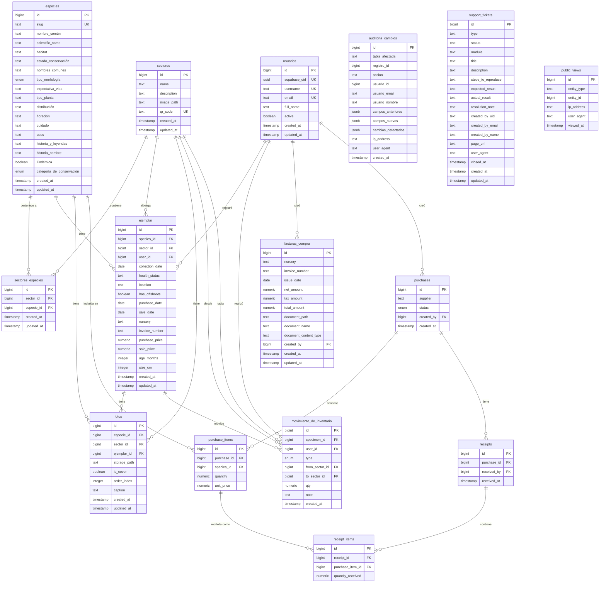

# Modelo de Datos — Cactario Casa Molle

Base de datos PostgreSQL gestionada por Supabase. Todas las tablas tienen Row-Level Security (RLS) habilitado.

---

## Diagrama ER

---

## Descripción de tablas

### `usuarios`
Whitelist de usuarios del staff. Solo los registros con `active = true` pueden iniciar sesión.
- `supabase_uid`: Se sincroniza automáticamente con Supabase Auth al primer login (OTP).
- `username`: Identificador único interno del usuario.
- Los usuarios se crean manualmente via `agregar_usuario.sql` — no hay registro público.

### `especies`
Catálogo de especies de cactáceas. Unidad central del sistema.
- `slug`: Identificador URL-friendly único. Usado por la app pública (`/especies/{slug}`).
- `tipo_morfología`: ENUM PostgreSQL — valores: `Columnar`, `Globosa`, `Rastrera`, `Arbustiva`, etc.
- `categoría_de_conservación`: ENUM PostgreSQL — valores UICN: `LC`, `NT`, `VU`, `EN`, `CR`, etc.
- Los campos de texto largo (`historia_y_leyendas`, `cuidado`, `usos`) se muestran en la app pública.

### `sectores`
Zonas físicas del cactario del hotel. Cada sector tiene un código QR impreso.
- `qr_code`: Valor único que se imprime en el cartel QR del sector. Formato libre, generalmente `SECTOR{id}`.
- `image_path`: Ruta de imagen de portada del sector (obsoleto en favor de `fotos`).
- La relación con especies se gestiona en `sectores_especies`.

### `sectores_especies`
Tabla de unión N:M entre sectores y especies. Indica qué especies viven en qué sector.
- Se crea automáticamente cuando se crea un `ejemplar` con `species_id` y `sector_id`.
- También se actualiza manualmente via `PUT /sectors/staff/{sector_id}/species`.

### `ejemplar`
Instancias físicas individuales de una especie. El inventario real del cactario.
- `health_status`: Estado de salud libre (texto).
- `nursery`: Vivero de origen (texto libre).
- `invoice_number`: Numero de factura asociado al ejemplar desde inventario. Sirve para vincular operativamente ejemplares con facturas existentes.
- `purchase_date` y `purchase_price`: Datos de compra del ejemplar. El flujo financiero/documental vigente vive en `facturas_compra`.
- `size_cm`: Tamaño en centímetros al momento del registro.

### `fotos`
Metadata de imágenes. El archivo físico se almacena en Cloudflare R2 (o Supabase Storage como fallback).
- `storage_path`: Clave del objeto en R2/Supabase Storage. Se construye la URL pública concatenando `R2_PUBLIC_BASE_URL + storage_path`.
- `especie_id`, `sector_id`, `ejemplar_id`: Solo uno tiene valor; los demás son NULL. Indica a qué entidad pertenece la foto.
- `is_cover`: Foto de portada del recurso. Solo una foto por entidad debería tener `is_cover = true`.
- Las variantes (w=400, w=800) se almacenan como filas separadas con el sufijo `?w=400` en el `storage_path`.

### `auditoria_cambios`
Log inmutable de todas las mutaciones del sistema.
- `accion`: normalmente `CREATE`, `UPDATE` o `DELETE`.
- `campos_anteriores` / `campos_nuevos`: JSON con el estado del registro antes y despues.
- `cambios_detectados`: Solo en `UPDATE` — JSON con los campos que cambiaron.
- Escrito siempre con `get_service()` (bypass RLS) para garantizar que el log persiste.

### `facturas_compra`
Facturas de compra ingresadas desde el modulo WMS "Compras y Ventas".
- `nursery`: Vivero/proveedor como texto libre; no hay tabla de viveros.
- `invoice_number`: Numero de factura, opcional.
- `issue_date`: Fecha de emision usada por filtros de `/transactions/purchases`.
- `net_amount`, `tax_amount`, `total_amount`: Montos de la factura.
- `document_path`, `document_name`, `document_content_type`: Metadata del documento subido a R2 bajo `facturas/{uuid}`.
- RLS esta habilitado; el backend opera con `get_service()` y no hay lectura publica.

### `support_tickets`
Tickets internos creados desde el WMS.
- `type`: `error`, `mejora` o `duda`.
- `status`: `en_espera`, `en_revision`, `resuelto` o `cancelado`.
- `module`: Modulo del WMS/App QR asociado.
- `created_by_uid`, `created_by_email`, `created_by_name`: Identidad del creador. No se usa FK directa para mantener compatibilidad con Supabase Auth.
- `resolution_note` y `closed_at`: Datos de cierre/resolucion.
- RLS esta habilitado y se revoca acceso a `anon`/`authenticated`; FastAPI usa `service_role` y aplica permisos en `support_tickets_service.py`.

### `movimiento_de_inventario`
Registra traslados de ejemplares entre sectores. El ENUM `type` incluye: `transfer`, `purchase`, `sale`, etc.

### `purchases`, `purchase_items`, `receipts`, `receipt_items`
Modelo legacy/documentado de ordenes de compra y recepciones. El flujo WMS actual de compras usa `facturas_compra` y los endpoints `/transactions/purchases`.

### `public_views`
Registro anónimo de visitas a especies/sectores desde la app pública. No requiere login.

---

## ENUMs de PostgreSQL

| ENUM | Tabla | Valores conocidos |
|------|-------|------------------|
| `tipo_morfología` | `especies` | `Columnar`, `Globosa`, `Rastrera`, `Arbustiva`, `Opuntoide`, `Cespitosa` |
| `categoría_de_conservación` | `especies` | `LC`, `NT`, `VU`, `EN`, `CR`, `EW`, `EX`, `DD`, `NE` |
| `purchase_status` | `purchases` | `Pendiente`, `Recibida`, `Cancelada` |
| `type` (movimiento) | `movimiento_de_inventario` | `transfer`, `purchase`, `sale` |

> Los ENUMs son tipos de PostgreSQL. Al enviar strings vacíos desde el backend, se deben convertir a `None` antes de insertar en Supabase para evitar errores de cast.

---

## Valores controlados por CHECK/texto

| Campo | Tabla | Valores |
|-------|-------|---------|
| `type` | `support_tickets` | `error`, `mejora`, `duda` |
| `status` | `support_tickets` | `en_espera`, `en_revision`, `resuelto`, `cancelado` |
| `module` | `support_tickets` | `Dashboard`, `Especies`, `Sectores`, `Inventario`, `Compras y Ventas`, `Reportes`, `Auditoria`, `Editor QR`, `Home App QR`, `Login`, `App QR Publica`, `Otro` |

---

## Notas de RLS (Row-Level Security)

- Todas las tablas tienen RLS activado en Supabase.
- Las operaciones públicas usan `get_public_clean()` (anon key, sin sesión) — solo ven lo que permite la policy pública.
- Las operaciones de staff usan `get_public()` con el token del usuario — las policies RLS del usuario aplican.
- Las operaciones de auditoría y admin usan `get_service()` (service role key) — bypass completo de RLS.
- Ver `backend/app/core/security.py` y `docs/security.md` para el detalle de las policies.
