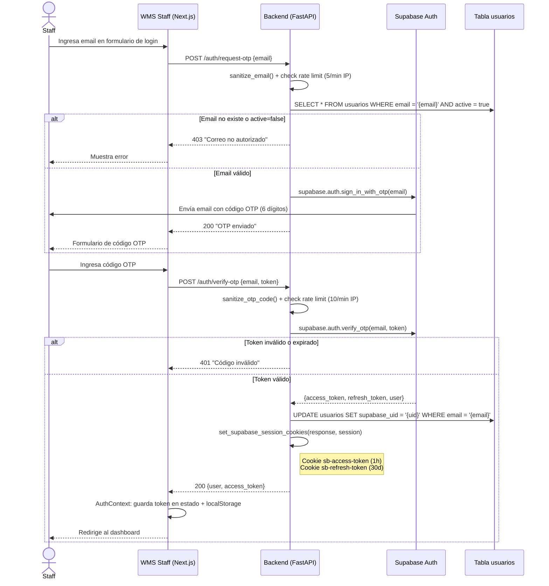
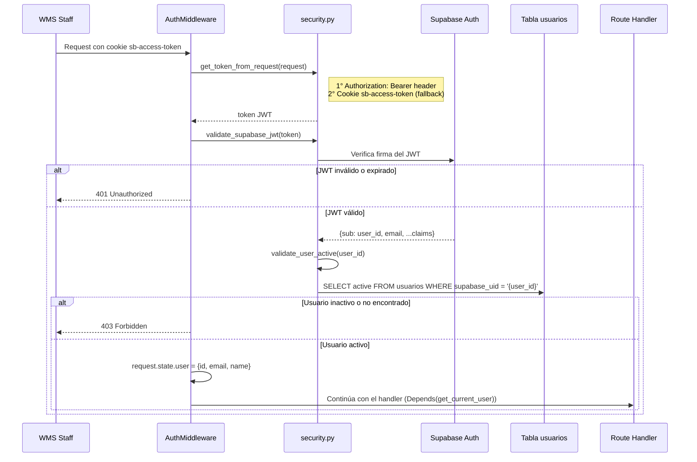
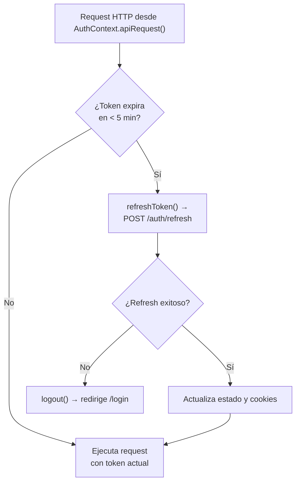

# Seguridad — Cactario Casa Molle

---

## Flujo de autenticación completo



---

## Validación de requests autenticados



---

## Auto-refresh del token (frontend)



El `AuthContext` de Next.js comprueba `isTokenExpiringSoon()` (< 5 min de vida) antes de cada llamada a `apiRequest()`. Si el token está por expirar, primero refresca y luego ejecuta el request.

---

## Configuración de cookies por entorno

Archivo: `fastapi/app/core/security.py`

| Entorno | Variable de detección | `samesite` | `secure` | Propósito |
|---------|----------------------|-----------|---------|-----------|
| Desarrollo | `IS_PRODUCTION` ausente | `lax` | `False` | Permite HTTP en localhost |
| Producción | `IS_PRODUCTION=true` | `none` | `True` | Cross-domain entre dominios Railway |

```python
IS_PRODUCTION = os.environ.get("RAILWAY_ENVIRONMENT") or os.environ.get("IS_PRODUCTION")

cookie_config = {
    "httponly": True,
    "samesite": "none" if IS_PRODUCTION else "lax",
    "secure": bool(IS_PRODUCTION),
}
```

**Nunca hardcodear `samesite` o `secure`** — siempre usar esta lógica. En producción, el WMS Staff y la API están en dominios `*.railway.app` distintos, lo que requiere `samesite=none; Secure`.

Cookies seteadas:
- `sb-access-token`: JWT de acceso. TTL: 1 hora.
- `sb-refresh-token`: Token de renovación. TTL: 30 días.

---

## Rate limiting

Archivo: `fastapi/app/api/routes_auth.py`

Implementado en memoria (dict por IP). Se resetea al reiniciar el servidor.

| Endpoint | Límite |
|----------|--------|
| `/auth/request-otp` | 5 requests/min por IP |
| `/auth/verify-otp` | 10 requests/min por IP |
| `/auth/master-key-login` | 5 requests/min por IP |

---

## Whitelist de usuarios

Solo los emails registrados en la tabla `usuarios` con `active = true` pueden recibir el OTP. El flujo valida esto **antes** de llamar a Supabase Auth, lo que evita envíos de correo no autorizados.

El campo `supabase_uid` se sincroniza automáticamente al primer login exitoso (`sync_user_supabase_uid`).

---

## Campos públicos vs internos

Los servicios del backend definen explícitamente qué campos se exponen en endpoints `/public`. Esto evita filtrar datos internos (precios de compra, viveros, estado de salud, auditoría) a los huéspedes.

| Recurso | Constante | Archivo |
|---------|-----------|---------|
| Especies | `PUBLIC_SPECIES_FIELDS` | `services/species_service.py` |
| Sectores | `PUBLIC_SECTOR_FIELDS` | `services/sectors_service.py` |

Al crear nuevos endpoints públicos: siempre usar la lista de campos permitidos, nunca `.select("*")`.

---

## Row-Level Security (RLS) de Supabase

RLS está habilitado en todas las tablas. Las policies controlan qué operaciones puede hacer cada tipo de cliente:

| Cliente | Key usada | Acceso |
|---------|-----------|--------|
| `get_public_clean()` | anon key | Solo lo que permite la policy pública (generalmente solo SELECT) |
| `get_public()` | anon key + sesión del usuario | Las policies del usuario autenticado |
| `get_service()` | service role key | Bypass completo — todas las operaciones |

**Regla general de uso:**
- Endpoints `/public` → `get_public_clean()`
- Endpoints `/staff` (reads) → `get_public()` con el token del usuario seteado en el cliente
- Escrituras y auditoría → `get_service()`

Para ver las policies SQL actuales, revisar `fastapi/app/core/security.py` y el archivo `verify_rls.sql` en la raíz de `fastapi/`.

---

## CORS

Archivo: `fastapi/app/main.py`

El middleware CORS acepta orígenes:
- Lista fija: `localhost:3000`, `localhost:3001`, `127.0.0.1:3000`
- Regex dinámico: `https://.*\.railway\.app`
- Regex ngrok: `https://.*\.ngrok.*` (para desarrollo con túnel)

```python
allow_origins=["http://localhost:3000", "http://localhost:3001", ...]
allow_origin_regex=r"https://.*\.(railway\.app|ngrok.*)"
allow_credentials=True
allow_methods=["*"]
allow_headers=["*"]
```

`allow_credentials=True` es necesario para que el browser envíe las cookies de sesión.

---

## Bypass de autenticación (solo desarrollo)

En el WMS Staff, configurar `NEXT_PUBLIC_BYPASS_AUTH=true` desactiva completamente la verificación de JWT. Útil para desarrollo local sin backend.

**Nunca usar en producción.** La variable no tiene efecto en el backend — solo afecta el middleware de Next.js y el `AuthContext`.
